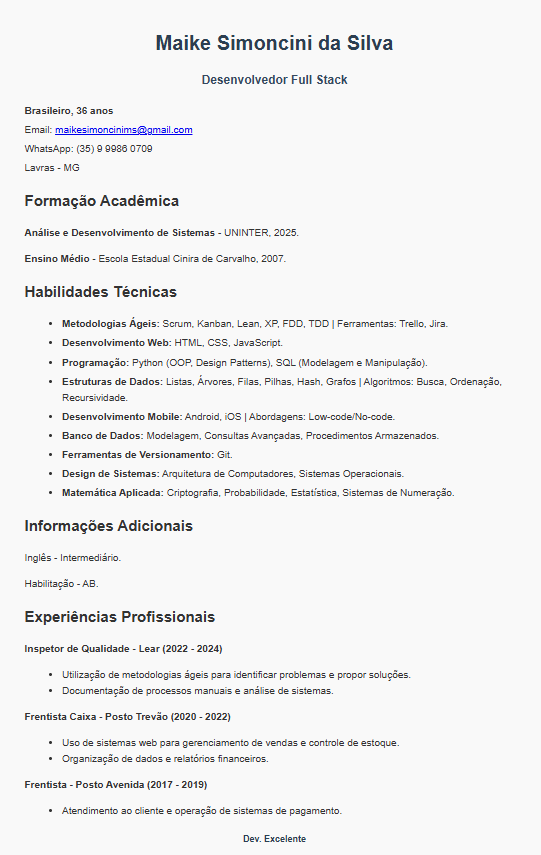

# 💼 Currículo - Maike Simoncini da Silva

Um currículo interativo e informativo para apresentar minhas habilidades e experiências como desenvolvedor Full Stack.

## 📜 Descrição do Projeto

Este projeto contém informações sobre minha formação acadêmica, habilidades técnicas e experiências profissionais. O objetivo é fornecer uma visão clara do meu perfil profissional.

## 🚀 Tecnologias Utilizadas

- HTML
- CSS

## 📁 Estrutura do Projeto

- `index.html` - Estrutura principal do currículo.
- `style.css` - Estilos da aplicação.

## 🎯 Funcionalidades

- 🖊️ Exibição de informações pessoais e de contato.
- 🎓 Seções para formação acadêmica e habilidades técnicas.
- 💼 Listagem de experiências profissionais.

### 📷 Demonstração

### 🔗 Link para o Projeto

👉 [Ver Currículo ao Vivo](https://maike-simoncini.github.io/Curriculo-Maike-Simoncini/) 👈

### 📄 Licença

Este projeto é de código aberto e pode ser utilizado por qualquer pessoa.
